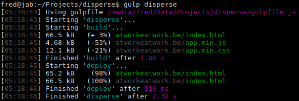

# Disperse

Builds websites from source and deploys them through FTP.

## Usage

```
gulp [build,deploy] [--site=domain.com] [--filter=glob]
```



### build, deploy

Type: `String`
Default: `build`

Specify task(s) to perform on site(s).

#### build

Generates site files from `src/sites/` into `build/`.

- [Handlebars](http://handlebarsjs.com) files are compiled with `src/layouts` and `src/partials`.
- Javascript and CSS files are minimized and merged into `app.min.js` and `app.min.css`.
- Previously built files whose contents haven't changed are left untouched, while leftovers are pruned.

#### deploy

Uploads site files from `build/` to their remote location as defined in `config.yaml`.

- Currently supported protocols are `ftp` and `sftp`.
- Only changed files are uploaded and there's no pruning.

### --site

Type: `String`
Default: sites with `active: true` in `config.yaml`

Specify site by domain.

### --filter

Type: `Glob`
Default: `undefined`

Filter site files by glob. See [node-glob](https://github.com/isaacs/node-glob) for the glob syntax.

## Configuration

### Site settings `config.yaml`

```
sites:
  yoursite.com:
    active: true
    url: https://yoursite.com/
    formTarget: https://yoursite.com/target.php
    analyticsEnabled: false
    analyticsId: UA-
    protocol: ftp
    host: ftp.yoursite.com
    port: 21
    timeout:
    remotePath: /www
    user:
    pass:
    template:
    description:
    pages:
      homepage: HTML page title goes here
      [...]
      contact: Page names become urls, i.e. yoursite.com/contact
```

## Author

- Fred Steegmans (u/jabman)